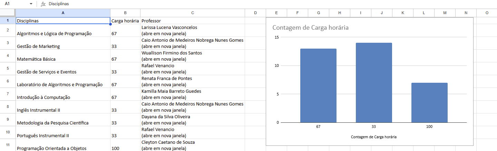

# Testes com Selenium

## Como utilizar
1. Criar o `virtualenv`
  ```bash
  python -m venv venv
  ```
2. Ativar o `virtualenv`
  - Windows
     ```bash
      venv/Scripts/activate.bat
      ```
  - Linux
    ```bash
    venv/Scripts/bin/activate
    ```
3. Instalar o Selenium com `pip`
  ```bash
  pip install selenium
  ```

---

## Resultado da tabela



---

## Teoria

* O botão direito do mouse é um clique de contexto (as opções aparecem de acordo com o contexto em que ele está)
* ActionChain: uma sequência de ações a serem executadas

---

## Melhorias futuras

* Reorganização da estrutura geral do projeto
* Finalização do README